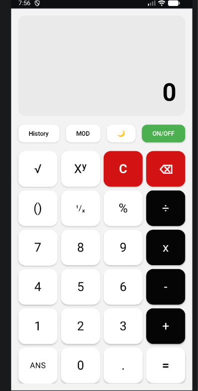
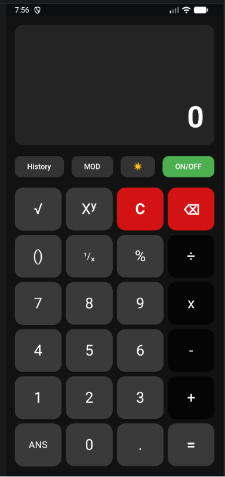

# 🧮 Android Calculator - Jetpack Compose


A modern, feature-rich Android Calculator built using **Kotlin**, **Jetpack Compose**, and **MVVM Architecture**. The application offers real-time calculation, advanced mathematical operations, smart expression processing, calculation history, theme switching, keyboard support, and a clean Material Design 3 interface.

---

# 📱 Overview

This project demonstrates modern Android development practices using **Jetpack Compose**, **MVVM Architecture**, and **LiveData**.

Instead of creating a mathematical parser from scratch, the calculator integrates the **Mozilla Rhino JavaScript Engine** for evaluating mathematical expressions while applying custom preprocessing for advanced features such as **Percentage**, **MOD**, **Power**, and **Square Root**.

## Highlights

- ⚡ Real-Time Result
- 📐 Advanced Mathematics
- 🧠 Smart Expression Processing
- 🌙 Dark & Light Mode
- 📜 Calculation History
- 🔋 ON/OFF Functionality
- 🔄 ANS Memory
- ⌨️ Physical Keyboard Support
- 📱 Responsive Material Design UI

---

# 📸 Screenshots

|           Light Mode            | Dark Mode | History |
|:-------------------------------:|:----------:|:----------:|
|  |  |  |

---

# ✨ Features

## 🧮 Standard Calculator

Supports all basic arithmetic operations.

- ➕ Addition
- ➖ Subtraction
- ✖️ Multiplication
- ➗ Division

---

## 📐 Advanced Mathematics

Supports

- Square Root (√)
- Power (Xʸ)
- Reciprocal (¹/ₓ)
- Percentage (%)
- Modulus (MOD)
- Parentheses (())
- Decimal Numbers

---

## ⚡ Real-Time Calculation

The calculator evaluates expressions while typing and instantly displays the current result without pressing the **Equals (=)** button.

---

## 🧠 Smart Expression Processing

The calculator intelligently processes user input before evaluation.

### Features

- Smart Operator Validation
- Automatic Multiplication
- Combined `()` Bracket Logic
- Automatic Bracket Completion
- Decimal Validation
- Smart Percentage Logic
- Independent MOD Operation
- Expression Conversion
- Real-Time Evaluation

---

## 🔁 Auto Multiplication

Automatically inserts multiplication where needed.

Example

```text
(5)2
```

becomes

```text
(5)×2
```

---

## 📊 Smart Percentage Logic

Percentage calculations behave similarly to real scientific calculators.

Example

```text
100 - 20%
```

Result

```text
80
```

---

## 🧮 MOD Operation

Supports a dedicated **MOD** operator.

Example

```text
10 MOD 3
```

Result

```text
1
```

Unlike Percentage, **MOD is processed independently**, ensuring accurate calculations without conflicts.

---

## 🔄 ANS Memory

Reuse the previous calculation instantly.

Example

```text
20 + 30 = 50

ANS + 10

Result = 60
```

---

## 📜 Calculation History

- Stores every successful calculation
- Scrollable History Dialog
- View previous calculations anytime

---

## 🌙 Dark / Light Mode

Switch instantly between

- 🌞 Light Mode
- 🌙 Dark Mode

The UI updates dynamically using Jetpack Compose State Management.

---

## 🔋 ON / OFF Button

Behaves like a real calculator.

Features

- Turn Calculator ON/OFF
- Disable Input
- Clear Display
- Reset Current State

---

## ⌨️ Physical Keyboard Support

Supports external keyboards for faster input.

| Key | Action |
|------|--------|
| 0–9 | Number Input |
| + | Addition |
| - | Subtraction |
| * / X | Multiplication |
| / | Division |
| Enter | Calculate |
| = | Calculate |
| Backspace | Delete Last Character |
| Delete | Delete Last Character |
| Esc | Clear Calculator |
| S | Square Root (√) |
| M | MOD |
| ^ | Power |
| % | Percentage |

---

## 🚫 Error Handling

Safely handles

- Invalid Expressions
- Division by Zero
- Infinity
- NaN
- Missing Parentheses

Instead of crashing, the application displays a user-friendly error.

---

# 🏗️ Project Structure

```text
Calculator_project
│
├── app/
│
├── docs/
│   └── screenshots/
│       ├── light.png
│       ├── dark.png
│       └── history.png
│
├── README.md
├── LICENSE
│
└── Gradle Files
```

---

# 🧩 Architecture

The project follows the **MVVM (Model-View-ViewModel)** Architecture.

```text
           User
             │
             ▼
      Jetpack Compose UI
             │
             ▼
        Calculator.kt
             │
             ▼
   CalculatorViewModel
             │
             ▼
 Mozilla Rhino JavaScript Engine
             │
             ▼
 Mathematical Expression Evaluation
             │
             ▼
         LiveData Update
             │
             ▼
          UI Refresh
```

---

# ⚙️ Mathematical Processing

Before evaluation, the calculator converts user-friendly mathematical symbols into Rhino-compatible expressions.

| User Input | Internal Conversion |
|------------|---------------------|
| × | * |
| ÷ | / |
| √ | Math.sqrt() |
| Xʸ | ** |
| ¹/ₓ | 1 / (...) |
| MOD | JavaScript Modulus Operator |
| % | Custom Percentage Processing |

After preprocessing, the expression is evaluated using the **Mozilla Rhino JavaScript Engine**.

---

# 🛠️ Technology Stack

| Technology | Purpose |
|------------|---------|
| Kotlin | Programming Language |
| Android Studio | Development Environment |
| Jetpack Compose | Modern UI Development |
| Material Design 3 | UI Components |
| MVVM | Architecture Pattern |
| ViewModel | Business Logic |
| LiveData | State Management |
| Mozilla Rhino | Mathematical Expression Evaluation |
| Regex | Expression Parsing & Validation |

---

# 🚀 Getting Started

## 📦 Download APK

The latest debug APK is available here:
[Calculator-v1.3-debug.apk](release/Calculator-v1.3-debug.apk)

---

## Clone Repository

```bash
git clone https://github.com/salmansync/Calculator_project.git
```

---

## Open Project

Open the project in **Android Studio Ladybug** or newer.

---

## Sync Gradle

Allow Android Studio to download all dependencies.

---

## Run

- Connect an Android device

or

- Launch an Android Emulator

Click the **▶ Run** button.

---

# 📦 Dependencies

```gradle
implementation("androidx.compose.material3:material3")
implementation("androidx.lifecycle:lifecycle-viewmodel-ktx")
implementation("androidx.lifecycle:lifecycle-livedata-ktx")
implementation("org.mozilla:rhino")
```

---

# 🚀 Future Improvements

- Scientific Calculator Mode
- Trigonometric Functions
- Logarithmic Functions
- Hyperbolic Functions
- Unit Converter
- Currency Converter
- Memory Functions (M+, M-, MR, MC)
- Better Animations
- Landscape Layout
- Tablet Optimization
- Calculation Export

---

# 👨‍💻 Author

**Salman Farsi**

GitHub: https://github.com/salmansync

---

# ⭐ Support

If you like this project, please consider giving it a **⭐ Star** on GitHub.

Your support motivates future improvements and new open-source projects.

---

# 📄 License

This project is licensed under the **Apache License 2.0**.

See the **LICENSE** file for more information.